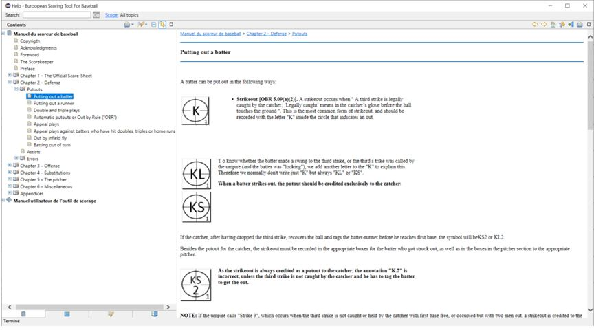

### L’aide dans l'outil

L’environnement Eclipse permet d’ajouter des fonctionnalités d’aide dans l’application. L’aide fournit peut-être deux types :

- L’aide générale ouvre une fenêtre permettant d’accéder à des pages d’aide particulières avec un module de recherche et une arborescence, comme dans un livre (Chapitre, sous chapitre, etc.). Au stade actuel du développement, seul la partie
  
  

Pour accéder à cette aide, l’utilisateur doit suive le menu principal ‘Aide’ -> ‘Help Content’

- Il existe aussi une aide contextuelle qui fournit une aide en fonction du contexte d’utilisation de l’application. Pour le moment cette forme d’aide n’est pas implémentée dans l’application.
