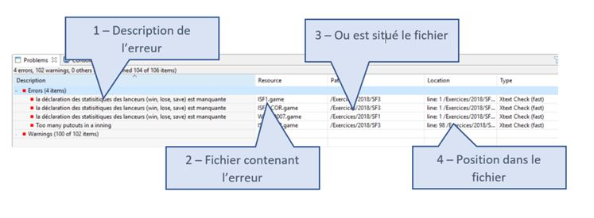
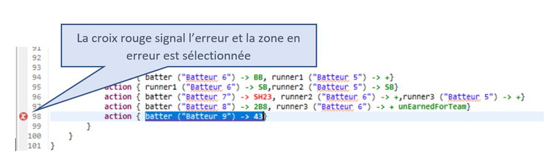
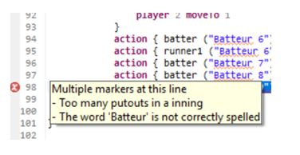
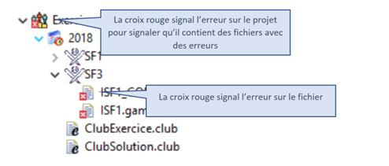

### La gestion des erreurs

L’environnement ‘Eclipse’ fournit de base un mécanisme de gestion d’erreur. Pour cela, il fourni une vue qui permet de lister toutes les erreurs et avertissement et effectue une décoration des éditeurs et des vues qui sont concernée par ces erreurs ou avertissement.
La vue qui liste les erreurs se nomme ‘Problems’ et fournit les informations suivantes :

Pour visualiser l’erreur, il suffit de cliquer sur la ligne décrivant l’erreur, l’éditeur ouvrira alors le fichier concerner et se positionnera automatiquement sur la ligne concernée.

cliquant sur la croix rouge, Eclipse affiche un cadre avec la description de l’erreur.

La vue ‘Project explorer’ affiche aussi une décoration sur les fichiers qui contiennent des erreurs ou des avertissements en affichant une croix ou un triangle orange au niveau du fichier.

