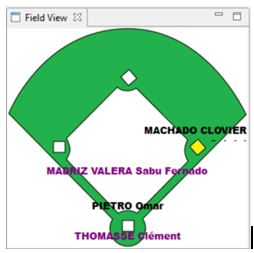

### La vue du champ intérieur

La vue du champ intérieur est juste une vue informative, elle donne la représentation à un instant du jeu de l’occupation du champ intérieur. Cette donne les noms du receveur et du lanceur, et donne un aperçu de l’occupation des bases par l’équipe en attaque et pour finir le nom du batteur qui se trouve au marbre.

Cette vue est utile lors de la saisie des feuilles de scorage car elle peut aider à la compréhension de l’action qui s’est déroulée
