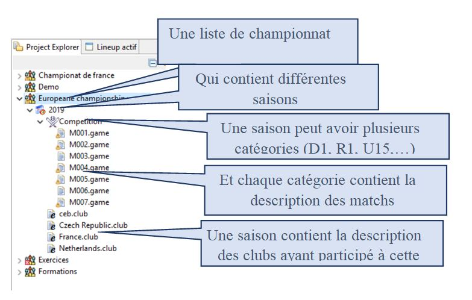

### La vue manageur de championnat

Cette vue est la vue principale de l’application. C’est elle qui permet la gestion du contenu d’un championnat. La vue est une représentation sous forme d’arbre du contenu de l’espace de travail en listant tous les championnats et pour chaque championnat, elle va lister leur contenus. 

Cette vue, pas l’intermédiaire va permettre d’ajouter, modifier ou supprimer des fichiers contenus dans un championnat.

 
La représentation de cette vue est définie comme ceci:

Cette vue est donc un des outils qui permettent de décrire tous les éléments qui vont être utilisés par l’application. 
