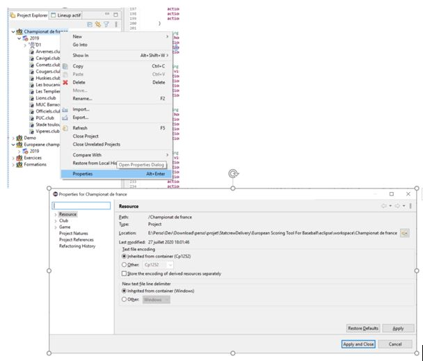

### Les propriétés

Les propriétés ont la même fonctionnalité que les préférences, mais elles permettent de spécifier des préférences au niveau d’un championnat uniquement. Pour accéder aux propriétés d’un championnat, l’utilisateur doit faire un clic droit sur le championat dans la vue ‘Project explorer’ et sélectionner ‘Properties’ dans le menu contextuel.

A l’état actuel du développement, les propriétés ne sont pas utilisées dans cette application.

