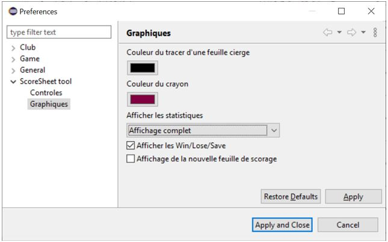

### Les préférences

Les préférences sont un mécanisme fournit par l’environnement Eclipse qui permettent de modifier le comportement de l’outil de manière générale. Par exemple, on peut régler les couleurs de la coloration syntaxique d’un éditeur, paramétrer l’affichage d’une vue, modifier la sévérité des problèmes, et tout autre paramètres…
Les préférences sont stockées dans l’espace de travail, et donc sont conservées après la fermeture de l’application.

Pour accéder aux préférences de l’application, il suffit d’utiliser le menu principal ‘Window’->’Preferences’ pour obtenir une fenêtre comme dans cet exemple.

Certaines préférences sont destinées pour l’utilisateur de l’outil, d’autre, comme par exemple l’onglet général, sont plutôt réservés aux utilisateurs expérimentés.
