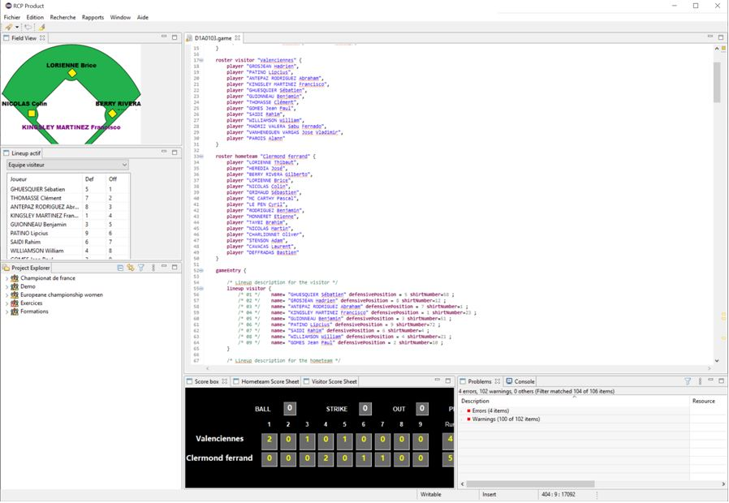
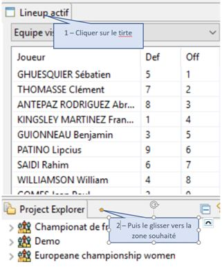
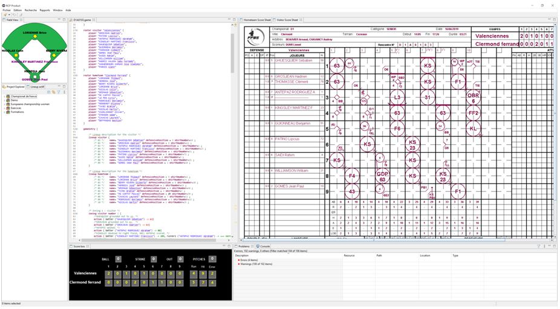
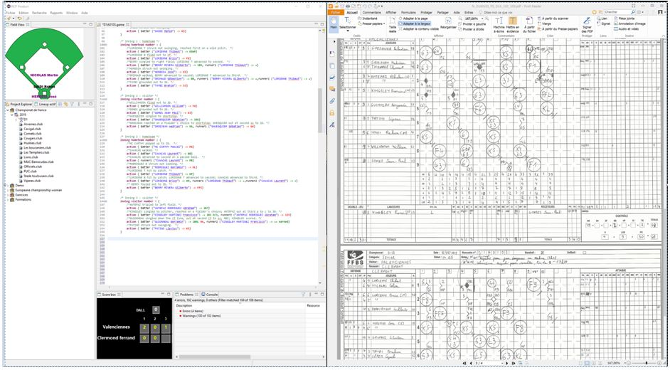
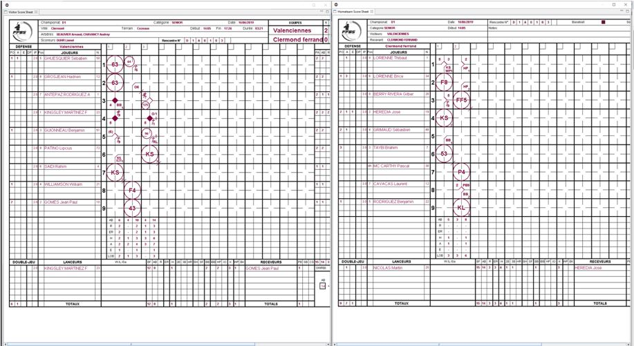

### Les perspectives

L’environnement Eclipse défini l’aspect visuel de l’outil de saisie, et en termes plus concret défini la position des vues, des éditeurs et des actions possibles sur l’outil comme par exemple le contenu des menus. La perspective par défaut de cette application est la suivante :

Vous pouvez changer cet arrangement des fenêtres à votre convenance et la nouvelle disposition sera mémorisée et restituée à la prochaine ouverture de l’application. Pour déplacer une fenêtre, vous devez appliquer la procédure suivante :

Vous pouvez donc modifier l’aspect visuel de l’outil comme dans l’exemple ci-dessous :

Cet environnement possède aussi une fonctionnalité bien pratique si, par exemple, vous avez deux écrans branchés sur votre PC. Vous pouvez sortir les vues ou les éditeurs de la fenêtre principal de l’application. L’exemple suivant décrit un environnement possible de saisie quand on sort les vues ‘feuille de scorage’ de la fenêtre principale.

Sur le premier écran, on affiche l’application avec l’éditeur de saisie avec, sur son coté le scan de la feuille de scorage.

Puis, sur le deuxième écran les deux vues qui restitue les feuilles de scorage.

Cette disposition vous permet de vérifier rapidement que votre saisie est conforme au scan des feuilles de scorage.
Certaines vues, comme les feuilles de scorage, peuvent être fermée. Elle n’apparaissent donc plus dans l’environnement de l’outil. Vous pouvez les rouvrir en utilisant le menu principal ‘Window’->’Show view’->’ et sélectionner la vue que vous souhaitez rétablir.
Pour finir, il est possible de revenir à la perspective par défaut en utilisant le menu ‘Window’->’Reset Perspective’. Cette action restitue la perspective par défaut, vous perdez alors les arrangements que vous aviez fait. 
